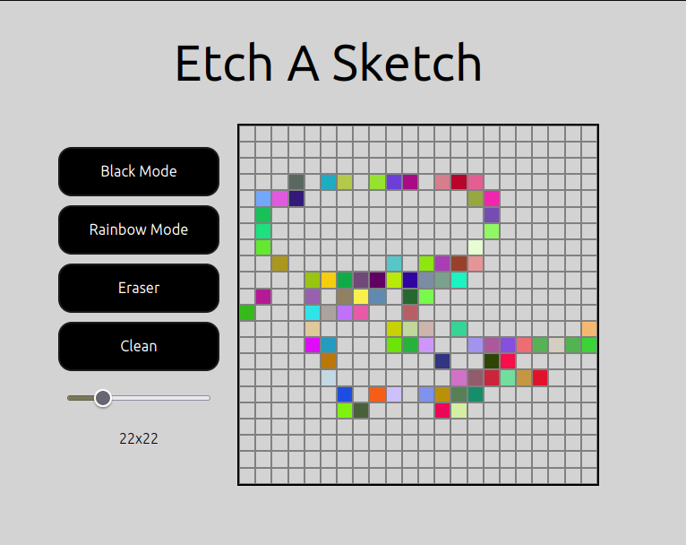
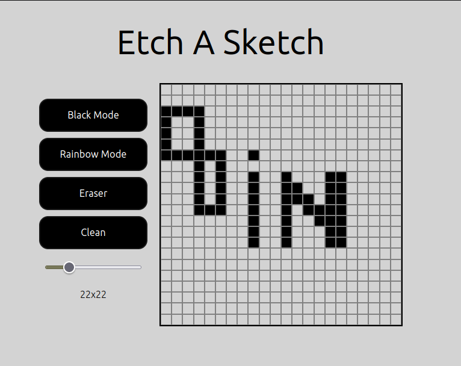

# Etch-a-Sketch

The Browser Sketchpad Project is a dynamic web application that simulates a sketchpad, offering an interactive platform for creating pixel art. It's a showcase of DOM manipulation skills, employing JavaScript, HTML, and CSS, including flexbox for layout. It is build as a part of [Odin Project](https://www.theodinproject.com/paths/foundations/courses/foundations/lessons/etch-a-sketch-project) curriculum.

Click to play the on a [live version](https://ufuksaylan.github.io/Etch-a-Sketch/).

## ScreenShots

